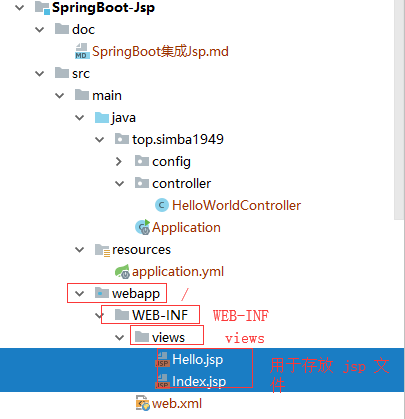

# SpringBoot 集成 Jsp

## 在 pom.xml 添加依赖

```xml
<!--jsp-->
<dependency>
    <groupId>javax.servlet</groupId>
    <artifactId>servlet-api</artifactId>
    <version>2.5</version>
    <scope>provided</scope>
</dependency>
<dependency>
    <groupId>javax.servlet</groupId>
    <artifactId>jsp-api</artifactId>
    <version>2.0</version>
    <scope>provided</scope>
</dependency>
<dependency>
    <groupId>jstl</groupId>
    <artifactId>jstl</artifactId>
    <version>1.2</version>
</dependency>
<!--War包部署到外部的Tomcat中已经包含了这些，
        所以需要添加以下依赖
        否则会和内嵌的Tomcat 容器发生冲突
        -->
<dependency>
    <groupId>org.springframework.boot</groupId>
    <artifactId>spring-boot-starter-tomcat</artifactId>
    <scope>provided</scope>
</dependency>
<!--用于编译jsp-->
<dependency>
    <groupId>org.apache.tomcat.embed</groupId>
    <artifactId>tomcat-embed-jasper</artifactId>
    <scope>provided</scope>
</dependency>
```

## application.yml

```yaml
server:
  port: 8081

spring:
  mvc:
    view:
      # 前缀 ，如果这里最后添加了一个/，那么就不需要在controller的函数返回的时候加/，否则就需要添加，一般都是在这里添加
      prefix: /WEB-INF/views/
      # 后缀
      suffix: .jsp
```

注意：这里的前缀和后缀要和创建的文件一致，如图：



## 创建一个 web.xml 并作为 module

web.xml

```xml
<?xml version="1.0" encoding="UTF-8"?>
<web-app xmlns="http://java.sun.com/xml/ns/javaee"
         xmlns:xsi="http://www.w3.org/2001/XMLSchema-instance"
         xsi:schemaLocation="http://java.sun.com/xml/ns/javaee
          http://java.sun.com/xml/ns/javaee/web-app_2_5.xsd"
         version="2.5">

</web-app>
```

作为 module，如图指示


## 必须继承 SpringBootServletInitializer 类

```java
package top.simba1949.config;

import org.springframework.boot.builder.SpringApplicationBuilder;
import org.springframework.boot.web.servlet.support.SpringBootServletInitializer;
import top.simba1949.Application;

/**
 * @author simba1949@outlook.com
 * @date 2018/10/21 17:10
 */
public class ServletInit extends SpringBootServletInitializer {
    @Override
    protected SpringApplicationBuilder configure(SpringApplicationBuilder builder) {
        // Application.class 指的是该项目的启动类
        return builder.sources(Application.class);
    }
}
```

## Jsp 文件

Index.jsp

```jsp
<%--
  Created by IntelliJ IDEA.
  User: SIMBA
  Date: 2018/10/21
  Time: 16:47
  To change this template use File | Settings | File Templates.
--%>
<%@ page contentType="text/html;charset=UTF-8" language="java" %>
<html>
<head>
    <title>Index JSP</title>
</head>
<body>

<a href="/say">调一下</a>

</body>
</html>
```

Hello.jsp

```jsp
<%--
  Created by IntelliJ IDEA.
  User: SIMBA
  Date: 2018/10/21
  Time: 17:33
  To change this template use File | Settings | File Templates.
--%>
<%@ page contentType="text/html;charset=UTF-8" language="java" %>
<html>
<head>
    <title>Welcome To JSP</title>
</head>
<body>

<h1>JSP 标题</h1>
<h1>JSP 取值：<%=request.getSession().getAttribute("say") %></h1>

</body>
</html>
```

启动时一定要使用 tomcat 启动，内嵌 tomcat 有问题。