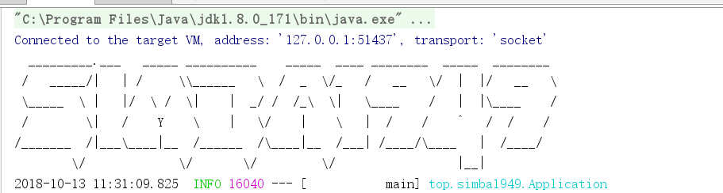
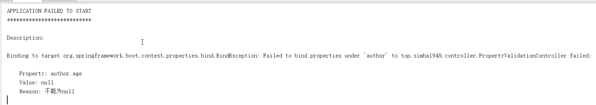
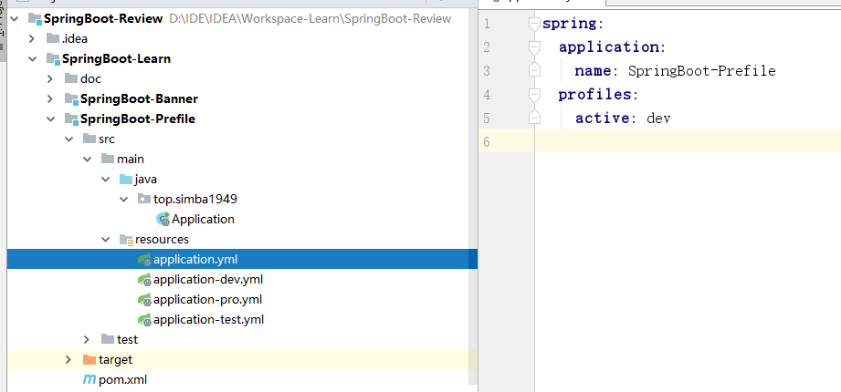
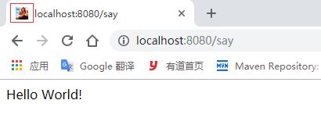
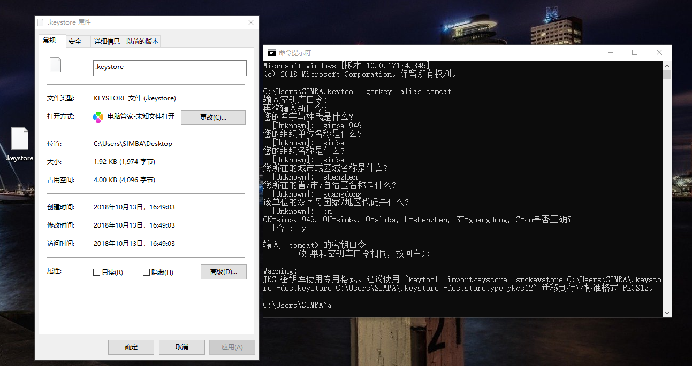
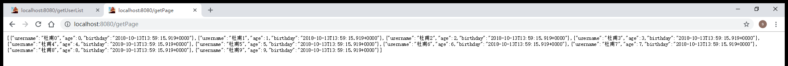
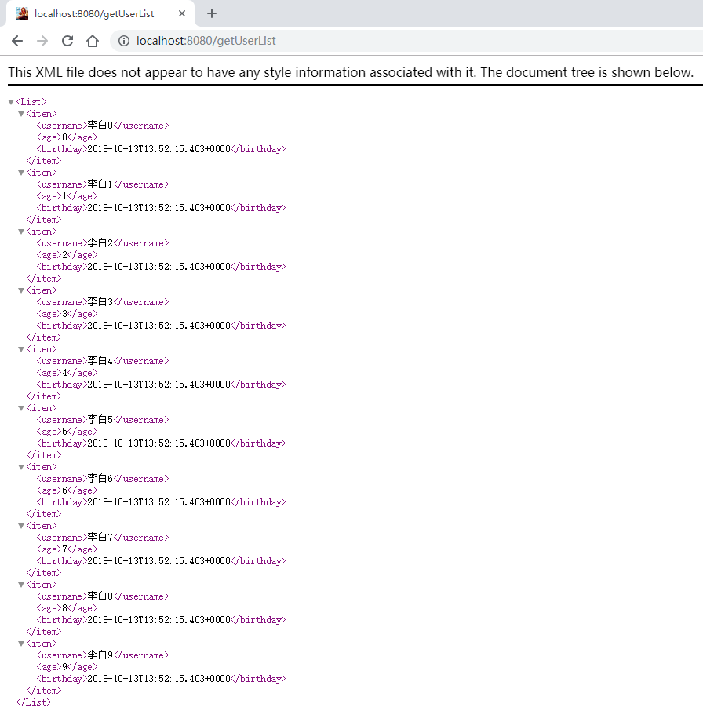
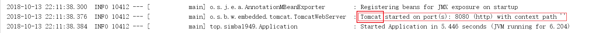
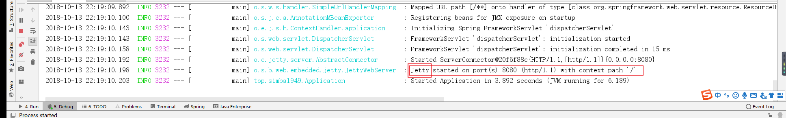
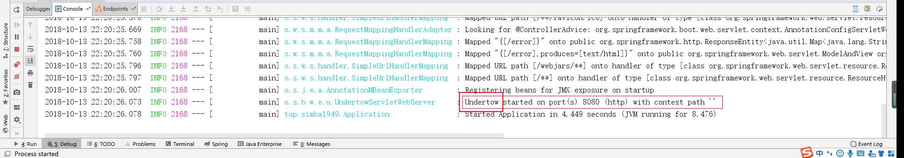

# SpringBoot 学习笔记

## 开发环境

*  JDK 1.8.0_171
* springboot 2.0.5.RELEASE
* Apache Maven 3.5.3

## SpringBoot 官方文档

https://docs.spring.io/spring-boot/docs/current/reference/html/index.html

## SpringBoot 入门

### pom.xml

```xml
<?xml version="1.0" encoding="UTF-8"?>
<project xmlns="http://maven.apache.org/POM/4.0.0"
         xmlns:xsi="http://www.w3.org/2001/XMLSchema-instance"
         xsi:schemaLocation="http://maven.apache.org/POM/4.0.0 http://maven.apache.org/xsd/maven-4.0.0.xsd">
    <modelVersion>4.0.0</modelVersion>

    <groupId>top.simba1949</groupId>
    <artifactId>SpringBoot-SimpleStart</artifactId>
    <version>1.0-SNAPSHOT</version>

    <parent>
        <groupId>org.springframework.boot</groupId>
        <artifactId>spring-boot-starter-parent</artifactId>
        <version>2.0.5.RELEASE</version>
    </parent>

    <properties>
        <java.version>1.8</java.version>
    </properties>

    <dependencies>
        <dependency>
            <groupId>org.springframework.boot</groupId>
            <artifactId>spring-boot-starter-web</artifactId>
        </dependency>
    </dependencies>

    <build>
        <plugins>
            <!--编译插件-->
            <plugin>
                <groupId>org.apache.maven.plugins</groupId>
                <artifactId>maven-compiler-plugin</artifactId>
                <configuration>
                    <!-- 配置使用的 jdk 版本 -->
                    <target>1.8</target>
                    <source>1.8</source>
                </configuration>
            </plugin>
            <!--springboot-maven打包插件-->
            <plugin>
                <groupId>org.springframework.boot</groupId>
                <artifactId>spring-boot-maven-plugin</artifactId>
            </plugin>
            <!--资源拷贝插件-->
            <plugin>
                <groupId>org.apache.maven.plugins</groupId>
                <artifactId>maven-resources-plugin</artifactId>
                <configuration>
                    <encoding>UTF-8</encoding>
                </configuration>
            </plugin>
        </plugins>
        <!--IDEA是不会编译src的java目录的xml文件，如果需要读取，则需要手动指定哪些配置文件需要读取-->
        <resources>
            <resource>
                <directory>src/main/java</directory>
                <includes>
                    <include>**/*.xml</include>
                </includes>
            </resource>
            <resource>
                <directory>src/main/resources</directory>
                <includes>
                    <include>**/*.xml</include>
                    <include>**/*.properties</include>
                </includes>
            </resource>
        </resources>
    </build>
</project>
```

### application.yml

```yaml
server:
  port: 8081
```

### Application.java

```java
package top.simba1949;

import org.springframework.boot.SpringApplication;
import org.springframework.boot.autoconfigure.SpringBootApplication;

/**
 * @author simba1949@outlook.com
 * @date 2018/10/13 9:59
 */
@SpringBootApplication
public class Application {
    public static void main(String[] args) {
        SpringApplication.run(Application.class, args);
    }
}
```

### 说明

SpringBoot 入口是 *Application 的入口类，入口类中有一个 main 方法，这是 SpringBoot 应用的入口方法。SpringBoot 会自动扫描 @SpringBootApplication 所在类的同级包以及下级包的 Bean。

## 关闭 SpringBoot 自动配置

### 编写一个自动配置的工程

创建一个要自动配置的 Bean

#### UserConfig.java

```java
package top.simba1949.config;

/**
 * @author simba1949@outlook.com
 * @date 2018/10/13 10:46
 */
public class UserConfig {

    private String username = "simba1949";

    @Override
    public String toString() {
        return "UserConfig{" +
                "username='" + username + '\'' +
                '}';
    }

    public String getUsername() {
        return username;
    }

    public void setUsername(String username) {
        this.username = username;
    }
}
```

配置 Bean 的配置文件

#### UserUtilAutoConfig.java

```java
package top.simba1949.config;

import org.springframework.boot.autoconfigure.EnableAutoConfiguration;
import org.springframework.context.annotation.Bean;

/**
 * @EnableAutoConfiguration 开启自动配置
 * 
 * @author simba1949@outlook.com
 * @date 2018/10/13 10:28
 */
@EnableAutoConfiguration
public class UserUtilAutoConfig {

    @Bean
    public UserConfig userConfig(){
        return new UserConfig();
    }
}
```

#### HelloWorldController.java

```java
package top.simba1949.controller;

import org.springframework.beans.factory.annotation.Autowired;
import org.springframework.web.bind.annotation.RequestMapping;
import org.springframework.web.bind.annotation.RestController;
import top.simba1949.config.UserConfig;

/**
 * @author simba1949@outlook.com
 * @date 2018/10/13 10:24
 */
@RestController
@RequestMapping("/world")
public class HelloWorldController {

    @Autowired
    UserConfig userConfig;

    @RequestMapping("/str")
    public String getString(){
        return userConfig.toString();
    }
}
```

#### Application.java

```
package top.simba1949;

import org.springframework.boot.SpringApplication;
import org.springframework.boot.autoconfigure.SpringBootApplication;
import top.simba1949.config.UserConfig;

/**
 * @author simba1949@outlook.com
 * @date 2018/10/13 10:23
 */
@SpringBootApplication
public class Application {
    public static void main(String[] args) {
        SpringApplication.run(Application.class, args);
    }
}
```

#### application.yml

```yaml
server:
  port: 8080
```

#### spring.factories

> 在 resources 新建 META-INF 目录，再新建 spring.factories 文件，注册上UserConfig，让 SpringBoot 知道并为你自动配置。
>
> org.springframework.boot.autoconfigure.EnableAutoConfiguration 是默认的key，value为要自动配置的类全限定名

```
org.springframework.boot.autoconfigure.EnableAutoConfiguration=top.simba1949.config.UserConfig
```

### 关闭自动配置工程

在上述项目 Application.java 配置 exclude 即可关闭，

#### Application.java

```java
package top.simba1949;

import org.springframework.boot.SpringApplication;
import org.springframework.boot.autoconfigure.SpringBootApplication;
import top.simba1949.config.UserConfig;

/**
 * @author simba1949@outlook.com
 * @date 2018/10/13 10:23
 */
@SpringBootApplication(exclude = {UserConfig.class})
public class Application {
    public static void main(String[] args) {
        SpringApplication.run(Application.class, args);
    }
}
```

> 注意：因为项目本身依赖 UserConfig ，如果没有配置 UserConfig ，项目便不会启动起来

## Banner

### 定制 Banner

在 SpringBoot 启动时会有一个默认的启动 Banner

```
  .   ____          _            __ _ _
 /\\ / ___'_ __ _ _(_)_ __  __ _ \ \ \ \
( ( )\___ | '_ | '_| | '_ \/ _` | \ \ \ \
 \\/  ___)| |_)| | | | | || (_| |  ) ) ) )
  '  |____| .__|_| |_|_| |_\__, | / / / /
 =========|_|==============|___/=/_/_/_/
 :: Spring Boot ::        (v2.0.5.RELEASE)
```

在 src/main/resources下新建一个 banner.txt，通过 <http://patorjk.com/software/taag> 网站生成字符，如敲入simba1949，将网站生成的字符复制在 banner.txt 中，即可定制

启动如图：



### 关闭 Banner

再启动类中设置

Application.java

```java
package top.simba1949;

import org.springframework.boot.Banner;
import org.springframework.boot.SpringApplication;
import org.springframework.boot.autoconfigure.SpringBootApplication;

/**
 * @author simba1949@outlook.com
 * @date 2018/10/13 11:27
 */
@SpringBootApplication
public class Application {
    public static void main(String[] args) {
        SpringApplication application = new SpringApplication(Application.class);
        // 关闭 banner 
        application.setBannerMode(Banner.Mode.OFF);
        application.run(args);
    }
}
```

## 创建一个可执行的 JAR

添加  SpringBoot-maven 打包插件

```xml
<!--springboot-maven打包插件-->
<plugin>
    <groupId>org.springframework.boot</groupId>
    <artifactId>spring-boot-maven-plugin</artifactId>
</plugin>
```

命令运行：mvn package 或者 package

会得到如下jar包

[INFO] Building jar: D:\IDE\IDEA\Workspace-Learn\SpringBoot-Review\SpringBoot-Learn\SpringBoot-Banner\target\SpringBoot-Banner-1.0-SNAPSHOT.jar

在命令窗口输入下面命令即可运行：

```
java -jar SpringBoot-Banner-1.0-SNAPSHOT.jar
```

## SpringBoot 配置文件

当 SpringBoot 的配置文件 application.properties 和 application.yml 同时存在时，SpringBoot 会优先加载 application.properties

### 添加一层拦截路径

```yaml
server:
  port: 8080
  servlet:
    context-path: /springboot
# 访问： http://localohost:8080/springboot/
```

### 读取配置文件中的数据

application.yml

```yaml
server:
  port: 8080

author:
  username: simba1949
  motto: 天道酬勤
  address: 深圳
```

HelloWorldController.java

```java
package top.simba1949.controller;

import org.springframework.beans.factory.annotation.Value;
import org.springframework.boot.context.properties.ConfigurationProperties;
import org.springframework.web.bind.annotation.RequestMapping;
import org.springframework.web.bind.annotation.RestController;

/**
 * @ConfigurationProperties(prefix = "author") 设置属性的前缀
 *
 * @author simba1949@outlook.com
 * @date 2018/10/13 11:57
 */
@RestController
@ConfigurationProperties(prefix = "author")
public class HelloWorldController {

    private String username;
    private String motto;
    @Value("${author.address}")
    private String authorAddress;

    @RequestMapping("/author")
    public String getAuthorInfo(){
        return username + motto + authorAddress;
    }

    public void setUsername(String username) {
        this.username = username;
    }

    public void setMotto(String motto) {
        this.motto = motto;
    }
}
```

> 使用前缀模式，必须提供 setter 方法；使用 @Value("${author.address}") 不需要提供 setter 方法

### 属性校验

> 使用 @Validated 开启属性校验功能

application.yml

```yaml
server:
  port: 8080

author:
  username: simba1949
  motto: 天道酬勤
  address: 深圳
  age:
```

PropertyValidationController.java

```java
package top.simba1949.controller;

import org.springframework.boot.context.properties.ConfigurationProperties;
import org.springframework.validation.annotation.Validated;
import org.springframework.web.bind.annotation.RestController;

import javax.validation.constraints.NotNull;

/**
 * @Validated 开启属性校验
 *
 * @author simba1949@outlook.com
 * @date 2018/10/13 12:17
 */
@Validated
@RestController
@ConfigurationProperties(prefix = "author")
public class PropertyValidationController {

    @NotNull
    private Integer age;

    public void setAge(Integer age) {
        this.age = age;
    }
}
```

验证不通过，项目便启动不起来，如图示



## 导入 properties 配置文件

author.properties

```properties
author.username=simba1949
author.motto=天道酬勤
```

book.properties

```properties
book.name=SpringBoot-Learn-Notes
book.time=2018-10-13 12:52:00
```

UseProperties.java

```java
package top.simba1949.properties;

import org.springframework.beans.factory.annotation.Autowired;
import org.springframework.beans.factory.annotation.Value;
import org.springframework.context.annotation.PropertySource;
import org.springframework.context.annotation.PropertySources;
import org.springframework.core.env.Environment;
import org.springframework.core.io.Resource;
import org.springframework.stereotype.Component;

import java.io.IOException;
import java.net.URI;
import java.net.URL;

/**
 * 使用 @PropertySources() 导入配置文件，里面是 @PropertySource 的数组
 * @PropertySource value 表示properties 配置文件，encoding 表示配置文件的编码格式
 *
 * @author simba1949@outlook.com
 * @date 2018/10/13 12:29
 */
@PropertySources({
        @PropertySource(value = "classpath:properties/author.properties",encoding = "UTF-8"),
        @PropertySource(value = "classpath:properties/book.properties", encoding = "UTF-8")
})
@Component
public class UseProperties {
    @Value("${author.username}")
    private String username;
    @Value("${author.motto}")
    private String motto;
    @Value("${book.name}")
    private String name;
    @Value("${book.time}")
    private String time;
    /**
     * 可以获取文件的流的读写
     */
    @Value("classpath:properties/author.properties")
    private Resource resource;

    public String getFile1() throws IOException {
        String filename = resource.getFilename();
        URL url = resource.getURL();
        String description = resource.getDescription();
        URI uri = resource.getURI();
        return filename + "\n" + url + "\n" + description + "\n" + uri;
    }

    @Value("classpath:properties/book.properties")
    private Resource resource2;
    public String getFile2() throws IOException {
        String filename = resource2.getFilename();
        URL url = resource2.getURL();
        String description = resource2.getDescription();
        URI uri = resource2.getURI();

        return filename + "\n" + url + "\n" + description + "\n" + uri;
    }

    /**
     * environment 代表所有文件，
     * 可以通过 environment.getProperty("author.username") 获取属性值
     */
    @Autowired
    private Environment environment;

    public String getContextByEnvironment(){
        String authorUsername = environment.getProperty("author.username");
        String authorMotto = environment.getProperty("author.motto");
        String bookName = environment.getProperty("book.name");
        String bookTime = environment.getProperty("book.time");
        return  authorUsername + "\n" + authorMotto + "\n" + bookName + "\n" + bookTime;
    }

    public String string(){
        return username + "\n" + motto + "\n" + name + "\n" + time;
    }
}
```

## 导入 XML 配置文件

UserBean.java

```java
package top.simba1949.bean;

/**
 * @author simba1949@outlook.com
 * @date 2018/10/13 13:16
 */
public class UserBean {

    public String userProviderString(){
        return "君不见黄河之水天上来 by UserBean";
    }
}
```

bean.xml

```xml
<?xml version="1.0" encoding="UTF-8"?>
<beans xmlns="http://www.springframework.org/schema/beans"
       xmlns:xsi="http://www.w3.org/2001/XMLSchema-instance"
       xsi:schemaLocation="
        http://www.springframework.org/schema/beans http://www.springframework.org/schema/beans/spring-beans.xsd"> <!-- bean definitions here -->

    <bean id="userBean" class="top.simba1949.bean.UserBean"/>
</beans>
```

XmlConfig.java

```java
package top.simba1949.config;

import org.springframework.context.annotation.Configuration;
import org.springframework.context.annotation.ImportResource;

/**
 * @ImportResource("classpath:xml/bean.xml") 使用 @ImportResource 即可导入 xml 配置文件
 * 
 * @author simba1949@outlook.com
 * @date 2018/10/13 13:21
 */
@Configuration
@ImportResource("classpath:xml/bean.xml")
public class XmlConfig {
}
```

## 简单的日志配置

### 官方日志网址：

https://docs.spring.io/spring-boot/docs/current/reference/html/boot-features-logging.html#boot-features-logging-format

application.yml

```yaml
server:
  port: 8080

spring:
  application:
    name: SpringBoot-SimpleLog

logging:
  # 日志级别
  level:
    root: debug
  # file 和 path 使用一个就好
  # 输出日志路径和名称,相对目录是相对当前最大项目的目录
  #file: SpringBoot-Learn/SpringBoot-SimpleLog/log/log.log
  # 输出日志的路径，不含名称，相对目录是相对当前最大项目的目录
  path: SpringBoot-Learn/SpringBoot-SimpleLog/log/
```

## profile 配置

Profile 是 Spring 用来针对不同的环境进行不同的配置提供支持的，全局 Profile 配置实用application-{profile}.properties。

通过在 application.properties 中设置 spring.profiles.active=dev 指定活动的 Profile。

测试：生产环境端口为80，开发环境端口为 8081，测试环境端口为 8082

生产环境（application-prod.properties）配置如下：

```
server.port=80
```

开发环境（application-dev.properties）配置如下：

```
server.port=8081
```

测试环境（application-test.properties）配置如下：

```
server.port=8082
```

目录结果如图



### 读取顺序

如果在不同的目录中存在多个配置文件，它的读取顺序是：

1. config/application.properties（最大项目根目录中config目录下）
2. config/application.yml
3. resources/config/application.properties（resources目录中config目录下）
4. resources/config/application.yml
5. resources/application.properties（resources目录下）
6. resources/application.yml

## Favicon配置

SpringBoot 默认开启，关闭 favicon 在 application.properties 中配置即可

```
spring.mvc.favicon.enabled=false
```

定制 Favicon

需要 spring.mvc.favicon.enabled 开启，不配置默认开启也可，将favicon.ico(文件名不能变动过)放置在类路径 /static、类路径 META-INF/resources、类路径 resources、类路径 static、类路径 public 下即可，运行效果



## http的编码配置

SpringBoot内置的自动配置功能：http的编码配置

默认编码方式为UTF-8，若修改可使用spring.http.encoding.charset=编码；

设置forceEncoding，默认为true，若修改可使用spring.http.encoding.force=false

```yaml
spring:
  http:
    encoding:
      charset: UTF-8
      force: true
```

## SSL 配置

> SSL：Secure Sockets Layer 安全套接层
>
> 是为了网络通信提供的安全数据完整性的一种安全协议，SSL 在网络传输层对网络连接进行加密。

生成证书：

> ```
> keytool -genkey -alias tomcat
> ```



将生成的.keystore文件复制到**项目的根目录**下，然后再application.properties中配饰SSL

```properties
server.ssl.key-store=.keystore
server.ssl.key-password=19491001
server.ssl.key-store-type=JKS
server.ssl.key-alias=tomcat
```

> 通过 HTTPS 和 HTTP 都无法实现客户端访问服务端：TODO

## SpringBoot 访问静态资源

```
把静态资源放置如下目录，可以直接访问到
/META-INF/resources
/resources
/static
/public

在 src/resources 目录下创建 static、public、resources 目录，该目录放置静态资源，可以通过

http://IP:PORT/static/fileName.suffixName 访问到，也可以在static目录下添加文件夹一样能访问到

可以直接在浏览器看到：图片，文本，pdf

下载：文件，zip，md，word，xls，
```

SpringBoot 2.0.5.RELEASE 版本需要配置才能正常访问到静态资源

```java
package top.simba1949.config;

import org.springframework.context.annotation.Configuration;
import org.springframework.web.servlet.config.annotation.ResourceHandlerRegistry;
import org.springframework.web.servlet.config.annotation.WebMvcConfigurer;

/**
 * @author simba1949@outlook.com
 * @date 2018/10/13 21:04
 */
@Configuration
public class WebConfig implements WebMvcConfigurer {

    @Override
    public void addResourceHandlers(ResourceHandlerRegistry registry) {
        // addResourceHandler 是设置访问路径前缀，
        // addResourceLocations 是设置资源路径
        registry.addResourceHandler("/static/**")
                .addResourceLocations("classpath:/static/");
        registry.addResourceHandler("/template/**")
                .addResourceLocations("classpath:/template/");
    }
}
```

## Json Rest 实现

在 SpringBoot 应用中，任何 @RestController 默认渲染为JSON响应

```java
package top.simba1949.controller;

import org.springframework.web.bind.annotation.GetMapping;
import org.springframework.web.bind.annotation.RestController;
import top.simba1949.common.UserCommon;

import java.util.ArrayList;
import java.util.Date;
import java.util.List;

/**
 * @author simba1949@outlook.com
 * @date 2018/10/13 22:03
 */
@RestController
public class User2Controller {

    /**
     * 在 SpringBoot 应用中，任何 @RestController 默认渲染为JSON响应
     * 请求方式中可以设置produces = "application/json"，也可不设置
     * @return
     */
    @GetMapping(value = "/getPage", produces = "application/json")
    public List<UserCommon> getPage(){
        List<UserCommon> list = new ArrayList<>();
        for (int i = 0; i < 10; i++){
            UserCommon userCommon = new UserCommon();
            userCommon.setUsername("杜甫" + i);
            userCommon.setAge(i);
            userCommon.setBirthday(new Date());
            list.add(userCommon);
        }
        return list;
    }
}
```

效果如图：



## XML Rest 实现

添加 jackson-dataformat-xml 扩展包，SpringBoot 会自动配置版本号

```xml
<!--Jackson XML扩展包-->
<dependency>
    <groupId>com.fasterxml.jackson.dataformat</groupId>
    <artifactId>jackson-dataformat-xml</artifactId>
</dependency>
```

请求方式中需要设置 produces = "application/xml"，即可返回 xml 数据

```java
package top.simba1949.controller;

import org.springframework.web.bind.annotation.GetMapping;
import org.springframework.web.bind.annotation.RestController;
import top.simba1949.common.UserCommon;

import java.util.ArrayList;
import java.util.Date;
import java.util.List;

/**
 * @author simba1949@outlook.com
 * @date 2018/10/13 21:46
 */
@RestController
public class UserController {
    /**
     * 请求方式中需要设置 produces = "application/xml"
     * @return
     */
    @GetMapping(value = "/getUserList", produces = "application/xml")
    public List<UserCommon> getUserList(){
        List<UserCommon> list = new ArrayList<>();
        for (int i = 0; i < 10; i++){
            UserCommon userCommon = new UserCommon();
            userCommon.setUsername("李白" + i);
            userCommon.setAge(i);
            userCommon.setBirthday(new Date());
            list.add(userCommon);
        }
        return list;
    }
}
```

效果如图：



## 拦截器

配置拦截器，需要实现 HandlerInterceptor 接口

```java
package top.simba1949.interceptor;

import org.springframework.stereotype.Component;
import org.springframework.web.servlet.HandlerInterceptor;
import org.springframework.web.servlet.ModelAndView;

import javax.servlet.http.HttpServletRequest;
import javax.servlet.http.HttpServletResponse;

/**
 * 拦截器，具体实现代码
 *
 * @author simba1949@outlook.com
 * @date 2018/10/13 17:16
 */
@Component
public class HelloWorldInterceptor implements HandlerInterceptor {

    @Override
    public boolean preHandle(HttpServletRequest request, HttpServletResponse response, Object handler) {
        System.out.println("1");
        // 返回 true 时，才会放行
        return false;
    }

    @Override
    public void postHandle(HttpServletRequest request, HttpServletResponse response, Object handler, ModelAndView modelAndView) {
        System.out.println("2");
    }

    @Override
    public void afterCompletion(HttpServletRequest request, HttpServletResponse response, Object handler, Exception ex) {
        System.out.println("3");
    }
}
```

注册拦截器，需要实现 WebMvcConfigurer 接口

```java
package top.simba1949.config;

import org.springframework.beans.factory.annotation.Autowired;
import org.springframework.context.annotation.Configuration;
import org.springframework.web.servlet.config.annotation.InterceptorRegistry;
import org.springframework.web.servlet.config.annotation.WebMvcConfigurer;
import top.simba1949.interceptor.HelloWorldInterceptor;

/**
 * 注册拦截器
 *
 * @author simba1949@outlook.com
 * @date 2018/10/13 17:17
 */
@Configuration
public class InterceptorConfig implements WebMvcConfigurer {

    @Autowired
    HelloWorldInterceptor helloWorldInterceptor;

    @Override
    public void addInterceptors(InterceptorRegistry registry) {
        // 添加拦截地址
        registry.addInterceptor(helloWorldInterceptor).addPathPatterns("/hello/**");
    }
}
```

## 全局异常处理

全局异常处理类，需要在类型上添加 @ControllerAdvice ，表明这是一个全局异常处理中心

@ExceptionHandler(value = Exception.class) 声明下面这个方法处理哪类异常

```java
package top.simba1949.exception;

import org.springframework.web.bind.annotation.ControllerAdvice;
import org.springframework.web.bind.annotation.ExceptionHandler;
import org.springframework.web.bind.annotation.ResponseBody;

/**
 * @ControllerAdvice 声明这是一个全局处理中心
 *
 * @author simba1949@outlook.com
 * @date 2018/10/13 20:48
 */
@ControllerAdvice
public class GlobalExceptionCenter {
    /**
     * @ExceptionHandler(value = Exception.class) 声明下面这个方法处理哪类异常
     *
     * @param e
     * @return
     */
    @ExceptionHandler(value = Exception.class)
    @ResponseBody
    public String dealWithException(Exception e){
        System.out.println(e.getMessage());
        return "网络异常";
    }
}
```

## SpringBoot 内置容器替换

SpringBoot 默认内置 tomcat 容器，

启动如图：



### tomcat 替换成 jetty 容器

```xml
<dependencies>
    <dependency>
        <groupId>org.springframework.boot</groupId>
        <artifactId>spring-boot-starter-web</artifactId>
        <!--排除 tomcat 容器-->
        <exclusions>
            <exclusion>
                <groupId>org.springframework.boot</groupId>
                <artifactId>spring-boot-starter-tomcat</artifactId>
            </exclusion>
        </exclusions>
    </dependency>
    <!--添加 jetty 容器-->
    <dependency>
        <groupId>org.springframework.boot</groupId>
        <artifactId>spring-boot-starter-jetty</artifactId>
    </dependency>
</dependencies>
```

启动如图：



### tomcat 替换成 undertow 容器

```xml
<dependencies>
    <dependency>
        <groupId>org.springframework.boot</groupId>
        <artifactId>spring-boot-starter-web</artifactId>
        <!--排除 tomcat 容器-->
        <exclusions>
            <exclusion>
                <groupId>org.springframework.boot</groupId>
                <artifactId>spring-boot-starter-tomcat</artifactId>
            </exclusion>
        </exclusions>
    </dependency>
    <!--添加 undertow 容器-->
    <dependency>
        <groupId>org.springframework.boot</groupId>
        <artifactId>spring-boot-starter-undertow</artifactId>
    </dependency>
</dependencies>
```

启动如图：



## 文件上传与下载

文件上传的前端代码

```html
<!DOCTYPE html>
<html lang="en">
<head>
    <meta charset="UTF-8">
    <title>File Upload</title>
</head>
<body>
	<!--文件上传必须添加enctype="multipart/form-data"属性值-->
	<form action="http://localhost:8080/file" method="post" enctype="multipart/form-data">
		<input type="file" name="file" />
		<input type="submit" value="提交" />
	</form>
</body>
</html>
```

controller 层代码

```java
package top.simba1949.controller;

import org.springframework.web.bind.annotation.RequestMapping;
import org.springframework.web.bind.annotation.RequestParam;
import org.springframework.web.bind.annotation.RestController;
import org.springframework.web.multipart.MultipartFile;

import javax.servlet.http.HttpServletRequest;
import java.io.File;
import java.io.IOException;

/**
 * @author simba1949@outlook.com
 * @date 2018/10/13 22:24
 */@RestController
public class FileController {

     @RequestMapping("/file")
    public String upload(@RequestParam(value = "file")MultipartFile file, HttpServletRequest request) throws IOException {
         // 获取 upload 目录，不存在就创建
         // 获取当前当前项目目录
         String path = FileController.class.getResource("/").getPath();
         String realPath = path.substring(1);
         File directory = new File(realPath + "upload/");
         if (!directory.exists()){
             directory.mkdirs();
         }
         // 将上传的文件写入到磁盘中
         file.transferTo(new File(directory + "/" + file.getOriginalFilename()));
         // 返回可以访问的路径
         return "http://localhost:8080/upload/" + file.getOriginalFilename();
    }
}
```

需要访问静态文件配置

```java
package top.simba1949.config;

import org.springframework.context.annotation.Configuration;
import org.springframework.web.servlet.config.annotation.ResourceHandlerRegistry;
import org.springframework.web.servlet.config.annotation.WebMvcConfigurer;

/**
 * @author simba1949@outlook.com
 * @date 2018/10/13 23:03
 */
@Configuration
public class WebConfig implements WebMvcConfigurer {

    @Override
    public void addResourceHandlers(ResourceHandlerRegistry registry) {
        registry.addResourceHandler("/upload/**").addResourceLocations("classpath:/upload/");
    }
}
```

application.yml

```yaml
server:
  port: 8080

spring:
  servlet:
    multipart:
      #默认支持文件上传.
      enabled: true
      #支持文件写入磁盘.
      file-size-threshold: 0
      # 最大支持文件大小
      max-file-size: 1024MB
      # 最大支持请求大小
      max-request-size: 1024MB
```

通过 http://localhost:8080/upload/ + 文件名即可以访问